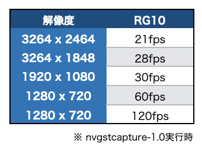

# CSI Camera

## 対応表

|機種名|メーカー|認識|
|:--|:--|:--|
|IMX219搭載カメラ|各社|○|

検証コマンド1

```
v4l2-ctl -d /dev/video0 --list-formats-ext
```

検証コマンド2

```
nvgstcapture-1.0
```


検証コード

```
import time
import cv2

def _gst_str_csi(id, cap_width, cap_height, fps, out_width, out_height):
	return 'nvarguscamerasrc sensor-id=%d ! video/x-raw(memory:NVMM), width=%d, height=%d, format=(string)NV12, framerate=(fraction)%d/1 ! nvvidconv ! video/x-raw, width=(int)%d, height=(int)%d, format=(string)BGRx ! videoconvert ! appsink' % (id, cap_width, cap_height, fps, out_width, out_height)
  
cap = cv2.VideoCapture(_gst_str_csi(0, 1280, 720, 120, 320, 240), cv2.CAP_GSTREAMER)

count = 0
start_time = time.time()
while(True):
    ret, frame = cap.read()
    if ret == 1:
	    count += 1
    now = time.time()
    cv2.imshow('csi camera',frame)
    if now - start_time > 1.0:
        print("fps: {}".format(count))
        count = 0
        start_time = now
    if cv2.waitKey(1) & 0xFF == ord('q'):
        break

cap.release()
cv2.destroyAllWindows()
```

|gstreamer Pipelineコマンド|解説|
|:--|:--|
|nvarguscamerasrc|[詳細](https://developer.ridgerun.com/wiki/index.php?title=Xavier/Video_Capture_and_Display/Software_Support/GStreamer)|
|sensor-id=0|認識したデバイスのデバイスID, 例 /dev/video0なら0, /dev/video3なら3||
|video/x-raw(memory:NVMM), width=1280, height=720, format=(string)NV12, framerate=(fraction)120/1|v4l2-ctlで調べた解像度とfpsを指定(1280x720, 120fps)|
|nvvidconv||
|video/x-raw, width=(int)320, height=(int)240, format=(string)BGRx|320x240,BGRxに変換|
|videoconvert||
|appsink||

## IMX219搭載カメラ




!!!warning "v4l2-ctlでの結果の差分"
	v4l2-ctlは、1280x720で最速 60fpsで表示されるが、実際には120fpsの速度がでている。