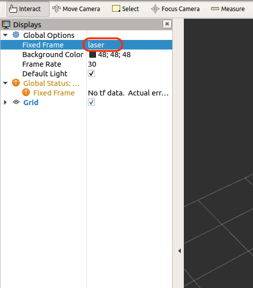
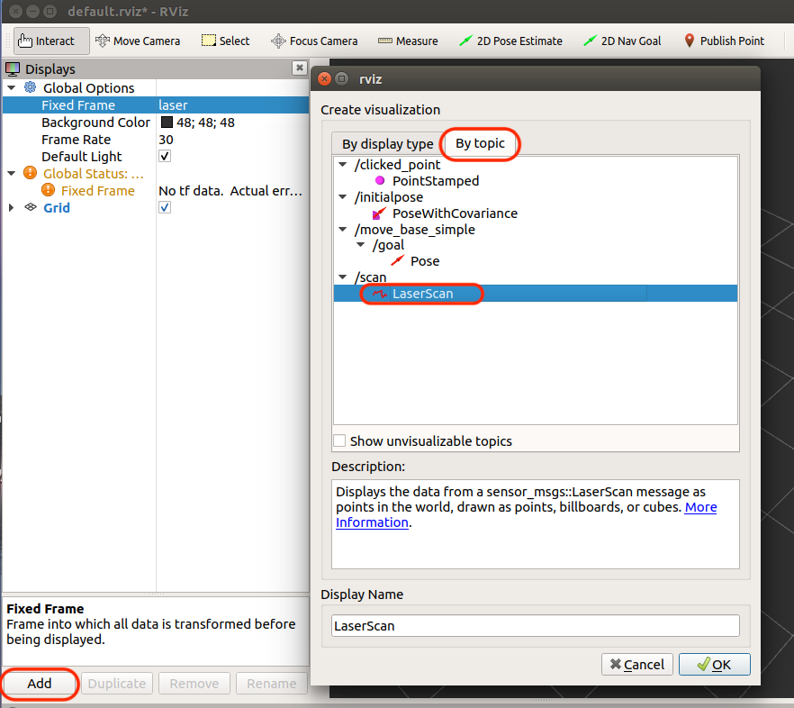

# Hokuyo


## ROSのインストール

Jetpack 4.3対応のROSのインストール

```
git clone https://github.com/jetsonhacks/installROSXavier
cd insyallROSXavier
./installROS.sh -p ros-melodic-desktop
```

ワークスペースの作成

```
mkdir -p ~/catkin_ws/src
cd ~/catkin_ws/
catkin_make
```

## URG Nodeのインストール

urg nodeのmake

```
cd ~/catkin_ws/src/
git clone https://github.com/ros-drivers/urg_node.git
catkin_make
```

## Jetson NXのeth0を固定IPに

/etc/network/interfaces
```
auto eth0
iface eth0 inet static
address 192.168.0.15
netmask 255.255.255.0
```

## 実行

rosの起動
```
roscore
```

urb nodeの起動
```
rosrun urg_node urg_node _ip_address:="192.168.0.10"
```

rvizの起動
```
rviz
```

## 設定






