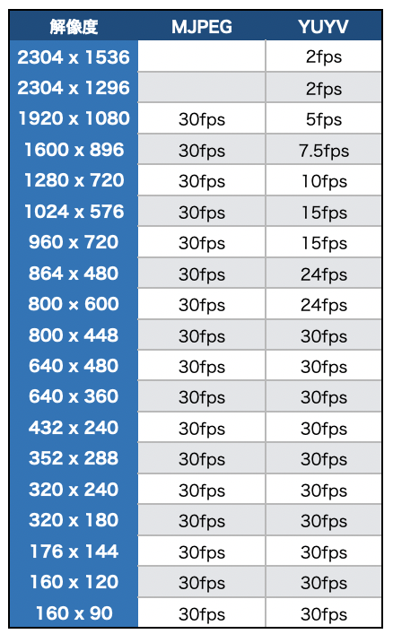
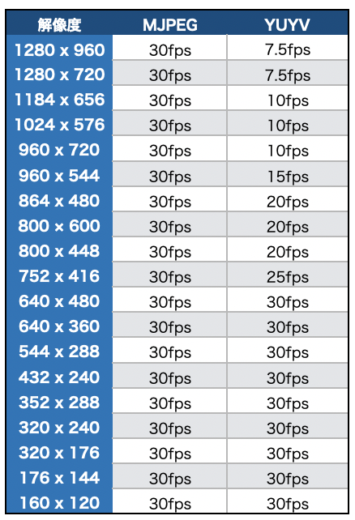
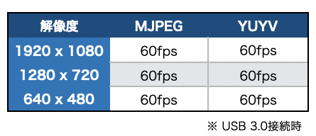
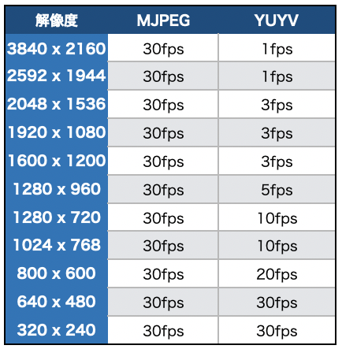
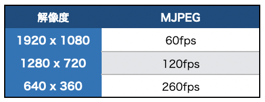

# UVC Camera

## 対応表

|機種名|メーカー|認識|
|:--|:--|:--|
|C922|logicool|○|
|C720|logicool|○|
|IMX291搭載カメラ|各社|○|
|IMX317搭載カメラ|各社|○|
|OV4689搭載カメラ|各社|○|

検証コマンド
```
v4l2-ctl -d /dev/video0 --list-formats-ext
```

検証コード
```
import time
import cv2

def _gst_str_yuyv(id, cap_width, cap_height, fps):
    return 'v4l2src device=/dev/video{} ! video/x-raw, width=(int){}, height=(int){}, framerate=(fraction){}/1 ! videoconvert !  video/x-raw, format=(string)BGR ! appsink'.format(id, cap_width, cap_height, fps)

def _gst_str_mjpeg(id, cap_width, cap_height, fps):
    return 'v4l2src device=/dev/video{} ! image/jpeg, width=(int){}, height=(int){}, framerate=(fraction){}/1 ! jpegdec ! videoconvert !  video/x-raw, format=(string)BGR ! appsink'.format(id, cap_width, cap_height, fps)

cap = cv2.VideoCapture(_gst_str_yuyv(0, 1280, 720, 60), cv2.CAP_GSTREAMER)
#cap = cv2.VideoCapture(_gst_str_mjpeg(0, 1280, 720, 60), cv2.CAP_GSTREAMER)

count = 0
start_time = time.time()
while(True):
    ret, frame = cap.read()
    if ret == 1:
        count += 1
    now = time.time()
    cv2.imshow('usb camera',frame)
    if now - start_time > 1.0:
        print("fps: {}".format(count))
        count = 0
        start_time = now
    if cv2.waitKey(1) & 0xFF == ord('q'):
        break

cap.release()
cv2.destroyAllWindows()
```

|gstreamer Pipelineコマンド(YUYV)|解説|
|:--|:--|
|v4l2src|[詳細](https://developer.ridgerun.com/wiki/index.php?title=Xavier/Video_Capture_and_Display/Software_Support/GStreamer)|
|device=/dev/video0|USBで認識したカメラのデバイス名を指定|
|video/x-raw, width=(int)1280, height=(int)720, framerate=(fraction)60/1|v4l2-ctlで調べた解像度とfpsを指定(1280x720, 60fps)|
|videoconvert||
|video/x-raw, format=(string)BGR|BGRに変換|
|appsink||

|gstreamer Pipelineコマンド(MJPEG)|解説|
|:--|:--|
|v4l2src|[詳細](https://developer.ridgerun.com/wiki/index.php?title=Xavier/Video_Capture_and_Display/Software_Support/GStreamer)|
|device=/dev/video0|USBで認識したカメラのデバイス名を指定|
|video/x-raw, width=(int)1280, height=(int)720, framerate=(fraction)60/1 |v4l2-ctlで調べた解像度とfpsを指定(1280x720, 60fps)|
|jpegdec||
|videoconvert||
|video/x-raw, format=(string)BGR|BGRに変換|
|appsink||

## C922



## C720




## IMX291搭載カメラ



検証コードのベンチマーク結果(実測値)

|サイズ|fps(平均)|フォーマット|
|:--|:--|:--|
|1920x1080|24fps|YUYV/MJPEG|
|1280x720|45fps|YUYV/MJPEG|
|640x480|49fps|YUYV/MJPEG|

## IMX317搭載カメラ



## OV4689



検証コードのベンチマーク結果(実測値)

|サイズ|fps(平均)|フォーマット|
|:--|:--|:--|
|1920x1080|22fps|MJPEG|
|1280x720|45fps|MJPEG|
|640x360|150fps|MJPEG|


GStreamer pipeline
```
v4l2src device=/dev/video0 io-mode=2 ! image/jpeg, width=640, height=360, format=MJPG ! jpegdec ! videoconvert ! video/x-raw, width=640, height=360 ! appsink
```