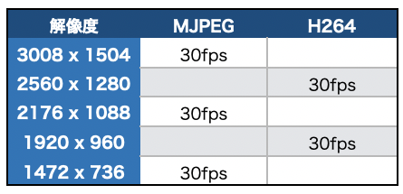

# 360度Camera

## 対応表

|機種名|メーカー|認識|
|:--|:--|:--|
|[OCAM-VRU01BK](https://www.elecom.co.jp/products/OCAM-VRU01BK.html)|elecom|○|
|[Insta360 Air](https://www.insta360.com/product/insta360-air)|Insta360|○|
|[Theta S](https://theta360.com/ja/about/theta/s.html)|Ricoh|○|


必要なパッケージ
```
sudo apt install --reinstall nvidia-l4t-gstreamer
```

検証コマンド
```
v4l2-ctl -d /dev/video0 --list-formats-ext
```

検証コード

```
import time
import cv2

def _gst_str_h264(id, cap_width, cap_height, fps, out_width, out_height):
    return 'v4l2src device=/dev/video{} ! video/x-h264, width=(int){}, height=(int){}, framerate=(fraction){}/1 ! queue ! nvv4l2decoder enable-max-performance=1 drop-frame-interval=1 ! nvvidconv ! video/x-raw, width=(int){}, height=(int){}, format=(string)BGRx ! videoconvert ! appsink'.format(id, cap_width, cap_height, fps, out_width, out_height)

cap = cv2.VideoCapture(_gst_str_h264(0, 2560, 1280, 30, 800, 400), cv2.CAP_GSTREAMER)

count = 0
start_time = time.time()
while(True):
    ret, frame = cap.read()
    if ret == 1:
        count += 1
    now = time.time()
    cv2.imshow('usb camera',frame)
    if now - start_time > 1.0:
        print("fps: {}".format(count))
        count = 0
        start_time = now
    if cv2.waitKey(1) & 0xFF == ord('q'):
        break

cap.release()
cv2.destroyAllWindows()
```

|gstreamer Pipelineコマンド(h264)|解説|
|:--|:--|
|v4l2src|[詳細](https://developer.ridgerun.com/wiki/index.php?title=Xavier/Video_Capture_and_Display/Software_Support/GStreamer)|
|device=/dev/video0|USBで認識したカメラのデバイス名を指定|
|video/x-h264, width=(int)2580, height=(int)1280, framerate=(fraction)30/1|v4l2-ctlで調べた解像度とfpsを指定(2580x1280, 30fps)|
|queue||
|nvv4l2decoder enable-max-performance=1 drop-frame-interval=1||
|nvvidconv||
|video/x-raw, width=(int)800, height=(int)400, format=(string)BGRx|800x400, BGRxに変換|
|videoconvert||
|appsink||


## OCAM-VRU01BK


## Insta360 Air



## Theta S


