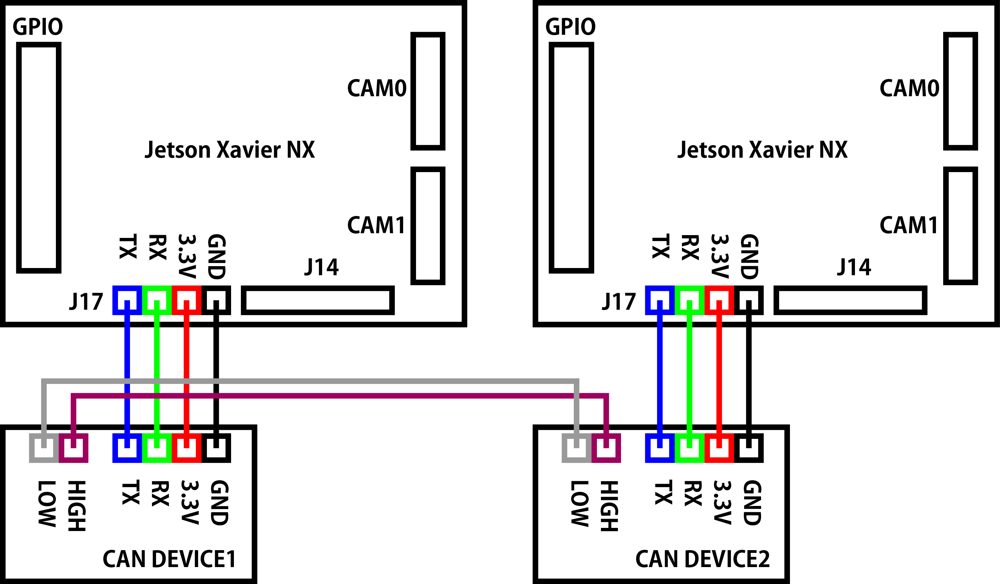
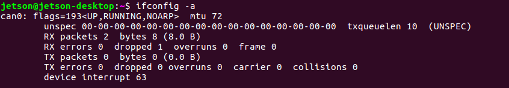
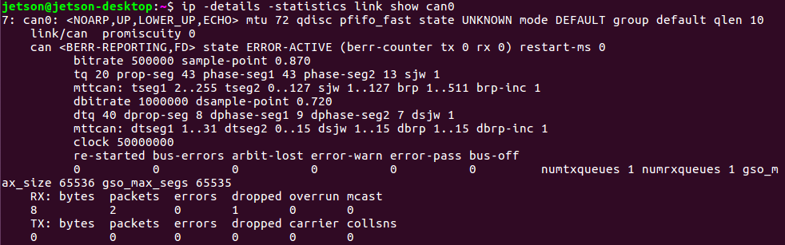
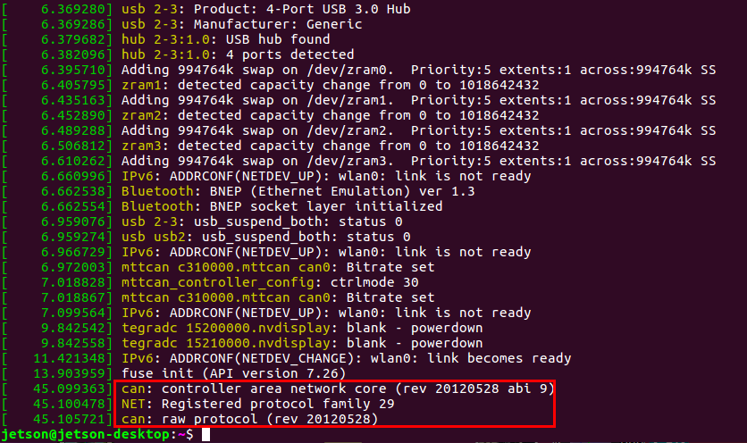

# CAN 有効化
<hr>

## CANとは
Controller Area Network(CAN)は、BOSCHが開発したマルチマスターのメッセージブロードキャストシステム。1メガビット/秒(bps)の最大シグナリングレートを規定しています。
USBやイーサネットなどの従来のネットワークとは異なり、CANは大きなブロックのデータを送りません。CANは中央バスマスタの監視下にあり、ノードAからノードBへのポイント to ポイント通信を行います。
CANネットワークでは、温度やRPMなどの短いメッセージがネットワーク全体にブロードキャストされるため、システムのすべてのノードでデータの一貫性が確保されます。

参考：
* [Introduction to the Controller Area Network(CAN)](https://www.ti.com/lit/an/sloa101b/sloa101b.pdf)

##### メモ
* [JetPack 3.2/TX2 CAN有効化](http://docs.fabo.io/jetson/JetPack3.2/TX2/setup/can.html)
* TX2の時と同じ流れで、NXはCAN0のみ
* JetPack 3.1以降はCANモジュールはカーネルに組み込まれている
* blacklist を解除する
* interfaces を追加する
* 配線が重要
* NXP TJA1050は5V
* TI SN65HVD230は3.3V/5V互換
* CANは5Vが主流だが、TIは3.3Vで動作するチップを用意。これにより消費電力を50%削減
* TX2フォーラムを見ると不安定になりやすいらしい
* デバイス間はGND接続もしたほうがいい
* Jetson Xavier NXでは3.3Vを使う
* TI SN65HVD230は2Vでも動作するが、HIGH/LOW電圧差に必要な2.45Vを出すことができなくなり、通信エラーの原因となる
* 3.3Vの電源電圧を安定させるために、ブーストレギュレータにはTPS60204 or TPS60205、もしくはsynch-pinsが必要ならTPS60100を使う
* Jetson Xavier NX Developer KitにはJ17にL字型の4PINのハンダ付けが必要
* [CAN bus without CAN Ground. Could be working with isolated node?](https://e2e.ti.com/support/interface/f/138/t/154819?CAN-bus-without-CAN-Ground-Could-be-working-with-isolated-node-)
* [nvidia developer forum](https://forums.developer.nvidia.com/t/how-to-using-can-in-nx-devkit/124153/3)のようにNXから出ていないCAN1のpinmux registerを変更する必要はなく、最初からJ17 CANが使えるように設定されている。


## check commands
```
dmesg
lsmod
ls /proc/device-tree/ | grep can
cat /proc/modules
ifconfig -a
ip -details -statistics link show can0
```
状態の確認ではdmesgが最も重要。
それ以外はあまり役に立たない。

## 配線


1台目のJetson NX

* Jetson NX 3.3V - CANdevice1 VCC
* Jetson NX GND - CANdevice1 GND
* Jetson NX CAN TR - CANdevice1 TR
* Jetson NX CAN TX - CANdevice1 TX

2台目のJetson NX

* Jetson NX 3.3V - CANdevice2 VCC
* Jetson NX GND - CANdevice2 GND
* Jetson NX CAN TR - CANdevice2 TR
* Jetson NX CAN TX - CANdevice2 TX

CANデバイス間の配線（GNDも付けた方がいい）

* CANdevice1 CANH - CANdevie2 CANH
* CANdevice1 CANL - CANdevie2 CANL


## setup
* blacklist mttcanをコメントにする
```
sudo vi /etc/modprobe.d/blacklist-mttcan.conf
```
before:
```
blacklist mttcan
```
after:
```
#blacklist mttcan
```

* can0インターフェースを追加する
FDだと5Mbpsになっているとのことなので、TX2では2Mbpsの2000000にしていた部分をNXでは5000000にしてインターフェースを作りたい所ですが、ここはTegraMTTCAN driverとチップに依存するため、TI SN65HVD230の1Mbps仕様に合わせて1000000とします。
```
sudo vi /etc/network/interfaces.d/can0
```
ファイル内容
```
auto can0
iface can0 inet manual
pre-up /sbin/ip link set $IFACE type can bitrate 500000 dbitrate 1000000 berr-reporting on fd on
up /sbin/ifconfig $IFACE up
down /sbin/ifconfig $IFACE down
```

インターフェース追加しない場合は、再起動の都度下記コマンドでcan0、ビットレートを設定して立ち上げます。
```
sudo ip link set can0 type can bitrate 500000 dbitrate 1000000 berr-reporting on fd on
sudo ip link set up can0
```

* 再起動
```
sudo reboot
```

## ifconfig確認
```
ifconfig -a
```
/etc/modprobe.d/blacklist-mttcan.confのブラックリストをコメントアウトして再起動するとifconfigでcanが表示されるようになります。



## ステータス確認
```
ip -details -statistics link show can0
```
で得られるステータスについて

* can state ERROR-ACTIVE
  * CANコントローラはエラーアクティブ状態に初期化されます。この状態には名前に"ERROR"という単語が含まれていますが、エラーがあるわけではありません。
* can state ERROR-PASSIVE
  * CANコントローラがエラーパッシブ状態にある場合、コントローラまたはその接続に潜在的な問題があるため、エラーフレームを送信することは出来ません。
* can state BUSS-OFF
  * CANコントローラが通信エラーを検出したときに、バストラフィックを説教的に廃棄せずにバスオフにします。CANコントローラはバストラフィックに全く関与しなくなります。
* can state STOPPED



## dmesg確認
通信が成功すれば以下のようなログになります。
```
[   45.099363] can: controller area network core (rev 20120528 abi 9)
[   45.100478] NET: Registered protocol family 29
[   45.105721] can: raw protocol (rev 20120528)
```



## 動作確認
1台目のNXターミナル
```
cansend can0 123#abcdabcd
```
2台目のNXターミナル
```
candump can0
```
データ受信時
```
can1 123 [4] AB CD AB CD
```


## トラブルシューティング
* dmesgを見るとエラーが出ていて、データ通信が出来ない
【原因】<br>
CANデータ送信時にデバイスを使う事が出来なかった。<br>
【解決方法】<br>
NXを再起動してください。


## 参考
[https://devtalk.nvidia.com/default/topic/1025010/jetson-tx2/how-to-use-can-on-jetson-tx2-/](https://devtalk.nvidia.com/default/topic/1025010/jetson-tx2/how-to-use-can-on-jetson-tx2-/)
[https://devtalk.nvidia.com/default/topic/1027411/jetson-tx2/tx2-can-error-entered-bus-off-state/](https://devtalk.nvidia.com/default/topic/1027411/jetson-tx2/tx2-can-error-entered-bus-off-state/)
[https://devtalk.nvidia.com/default/topic/1011148/enable-can-bus-on-jetson-tx2/?offset=5](https://devtalk.nvidia.com/default/topic/1011148/enable-can-bus-on-jetson-tx2/?offset=5)
[https://devtalk.nvidia.com/default/topic/1019795/jetson-tx2/jetpack-3-1-can-bus-support/](https://devtalk.nvidia.com/default/topic/1019795/jetson-tx2/jetpack-3-1-can-bus-support/)
[http://www.ti.com/lit/an/sloa101b/sloa101b.pdf](http://www.ti.com/lit/an/sloa101b/sloa101b.pdf)
[https://www.nxp.com/docs/en/data-sheet/TJA1050.pdf](https://www.nxp.com/docs/en/data-sheet/TJA1050.pdf)
[https://forums.developer.nvidia.com/t/how-to-using-can-in-nx-devkit/124153](https://forums.developer.nvidia.com/t/how-to-using-can-in-nx-devkit/124153)
[https://docs.nvidia.com/drive/drive_os_5.1.6.1L/nvvib_docs/index.html#page/DRIVE_OS_Linux_SDK_Development_Guide/System%20Programming/sys_components_tegra_can.html](https://docs.nvidia.com/drive/drive_os_5.1.6.1L/nvvib_docs/index.html#page/DRIVE_OS_Linux_SDK_Development_Guide/System%20Programming/sys_components_tegra_can.html)
